# Keel

Keel is a marketing site for a product workspace: issues, projects, and cycles in one place. The copy and layout are built to feel quiet — near-black background, one amber accent, and a single load-in on the hero.

This README walks the site in the order a visitor sees it, using every screenshot in [`images/`](images/). Company names in the customers strip are fictional. **Start a workspace** and **Log in** create a real account: the password is hashed, the session is an httpOnly cookie, and the record is stored in `data/accounts.json` (not committed).

## Run it

```bash
npm install
npm run dev
```

The Next.js app (Turbopack) listens on [http://127.0.0.1:3847](http://127.0.0.1:3847). Signup, login, and `/account` need this server. GitHub Pages is static and cannot run the auth API.

```bash
npm run lint
npm run build
npm start
```

`npm start` serves the production server on port 3847.

`prefers-reduced-motion` skips the hero sequence.

## Accounts

| Action | What happens |
| --- | --- |
| `POST /api/auth/signup` | Creates the workspace, hashes the password with scrypt, sets a 14-day cookie |
| `POST /api/auth/login` | Checks the password and sets the same cookie. Wrong email and wrong password return the same error |
| `GET /api/auth/me` | Returns the signed-in workspace, email, and plan |
| `POST /api/auth/logout` | Deletes that session |
| `/account` | The page you land on after signup or login |

Passwords are at least 8 characters. A duplicate email is rejected. Eight tries in ten minutes from the same address pauses signup and login. The cookie is `keel_session`, httpOnly, SameSite=Lax, and `Secure` in production.

## GitHub

`.github/workflows/ci.yml` runs lint and `npm run build` on Node 22. It does not publish the site: a static host cannot keep the session or the account file.

```bash
git add -A
git commit -m "Add workspace signup and login."
git push
```

To run it yourself after a clone: `npm install` then `npm run dev`.

## Visual system

| Token | Role |
| --- | --- |
| `#0A0A0B` | Page background (`ink`) |
| `#121214` | Panels and cards |
| `#F3EFE6` | Primary type (`paper`) |
| `#B7B1A6` | Secondary type (`mute`) |
| `#E4A23C` | Accent, primary buttons, recommended plan |

Type is Instrument Sans. Motion is limited to the hero reveal and form confirmations.

## Pages

| Path | What it is |
| --- | --- |
| `/` | Landing: nav, hero, features, customers, pricing, closing CTA, footer |
| `/pricing` | Same plans plus FAQ |
| `/docs` | Index of four short articles |
| `/docs/getting-started`, `/docs/keyboard`, `/docs/cycles`, `/docs/triage` | Individual articles |
| `/signup`, `/login` | Create a workspace or sign in. Both set a session cookie |
| `/account` | The signed-in workspace |
| `/privacy`, `/terms` | Legal copy |

---

## 1. Home on desktop

The header stays sticky. Left: mark and **Keel**. Center: Product, Pricing, Docs, Customers. Right: Log in, **Start a workspace** (amber), and a Menu control.

The hero headline is **A quieter home for product work.** Body copy: issues, projects, and cycles in one fast workspace. Two actions sit under the copy: **Start a workspace** and **See pricing**.

To the right is a mock cycle list (`Core / Cycle 18`, 12 open). Rows show issue id, title, status, and owner. Status colors match the rest of the site: amber for in progress, mute for todo and done. The last row is a keyboard hint: `C` to file an issue. Cycle 18 ends Friday.

Below the fold the features section starts: **The week has four shapes.**

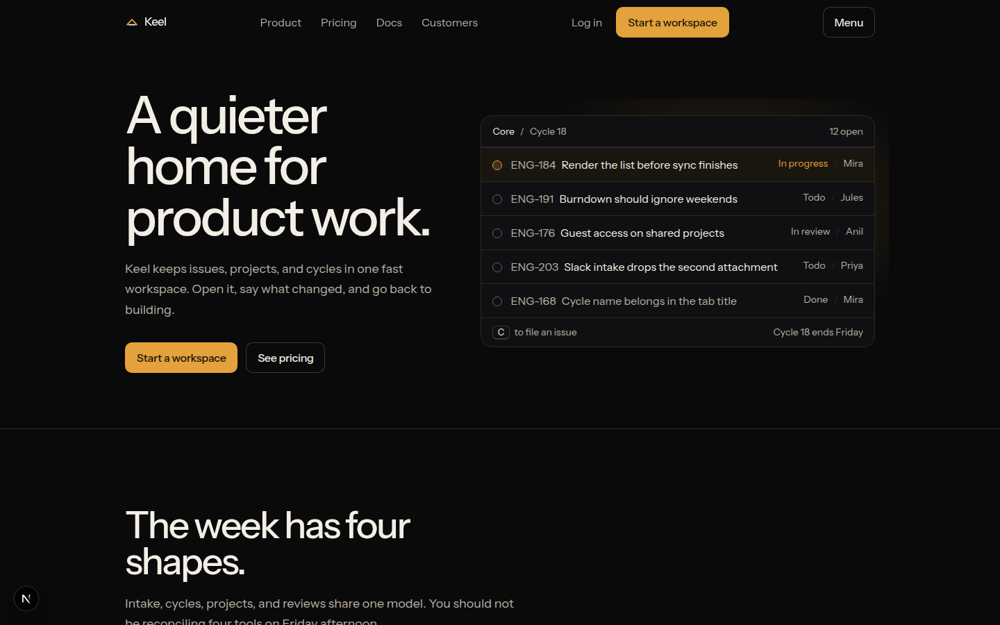

---

## 2. Home on a phone

On a narrow viewport the center nav is gone. The header is mark, name, and **Menu**. Headline and copy stack full width. The two CTAs sit side by side. The cycle mock sits under the buttons instead of beside the copy, so the same story still reads in one column.

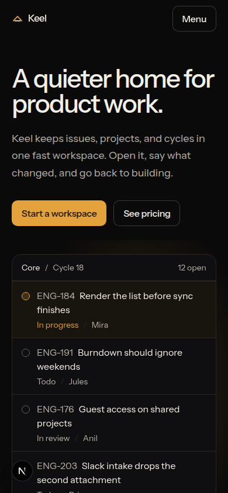

---

## 3. Product menu (desktop)

**Product** opens a dropdown with four anchors on the home page:

| Item | Line | Jumps to |
| --- | --- | --- |
| Intake | A thread becomes an issue | `/#intake` |
| Cycles | A scope with an end date | `/#cycles` |
| Projects | The roadmap is the work | `/#projects` |
| Reviews | The change sits on the issue | `/#reviews` |

Escape or a click outside closes it. Pricing, Docs, and Customers stay ordinary links.

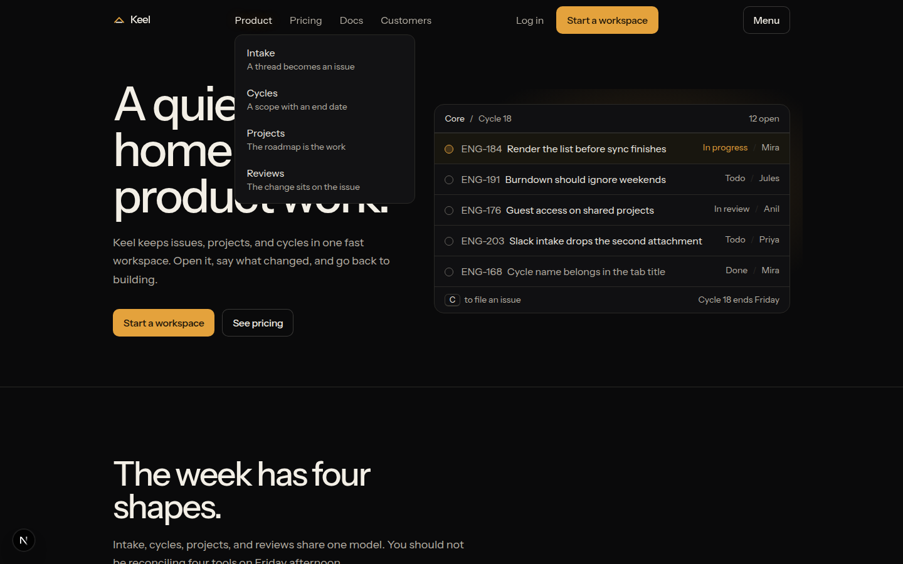

---

## 4. Phone menu

**Menu** opens a full-height sheet. **Close** sits top right. Links: Product anchors (Intake, Cycles, Projects, Reviews), then Pricing, Docs, Customers. **Log in** and **Start a workspace** are pinned at the bottom so they stay reachable without scrolling the sheet.

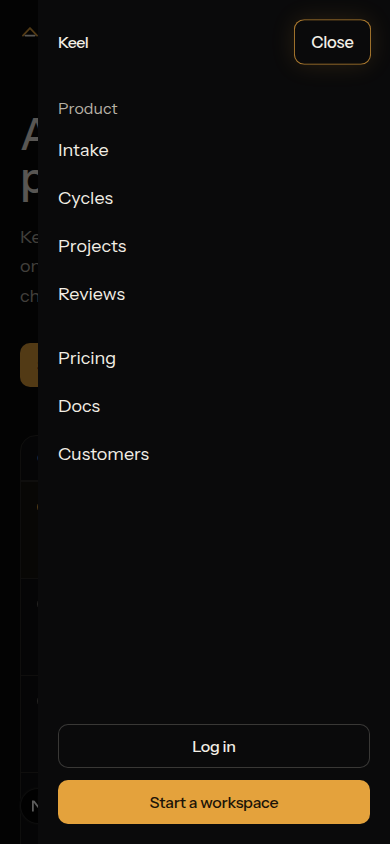

---

## 5. Intake

Section title: **The week has four shapes.** Intake, cycles, projects, and reviews share one model — you should not be reconciling four tools on Friday afternoon.

**A thread becomes an issue.** Keel watches the channels you choose, drafts the issue, and drops it in the right team’s triage. Labels come from words people already used. You can see the draft before it lands.

The mock on the right is a Slack-style thread (`#ios, this morning`) that becomes a drafted issue: *Paint the home shell before sync finishes*, assigned to Didier, label `performance`, drafted into Core.

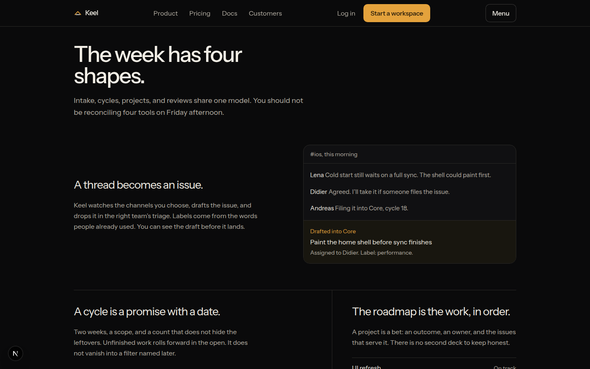

---

## 6. Cycles and projects

**A cycle is a promise with a date.** Two weeks, a scope, and a count that does not hide leftovers. Unfinished work rolls forward in the open. It does not vanish into a filter named later.

The bar is Done **18**, Still open **6**, Rolled in **2**. Two leftover issues sit under the bar so the roll-in is visible.

**The roadmap is the work, in order.** A project is a bet: an outcome, an owner, and the issues that serve it. There is no second deck. The mock lists UI refresh (on track), Guest accounts (at risk), Offline drafts (not started).

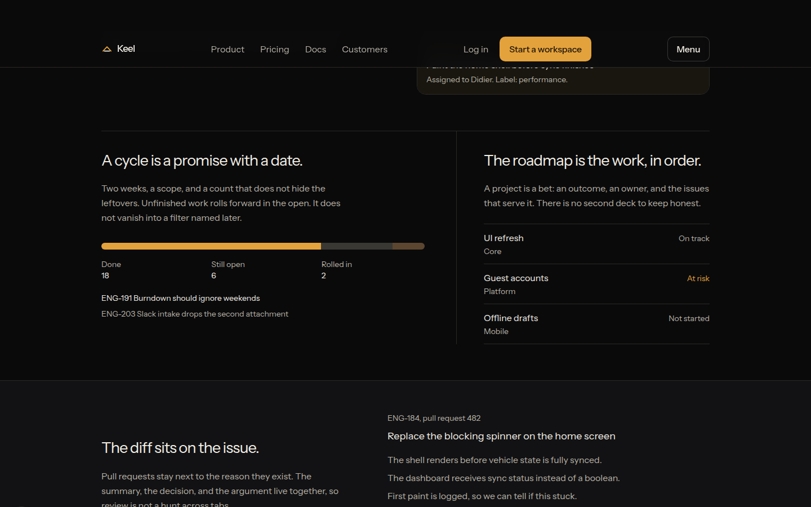

---

## 7. Reviews

**The diff sits on the issue.** Pull requests stay next to the reason they exist. Summary, decision, and argument live together, so review is not a hunt across tabs.

The mock is ENG-184, pull request 482: *Replace the blocking spinner on the home screen*, three bullets of the change, and a comment from Anil about keeping the log for a cycle.

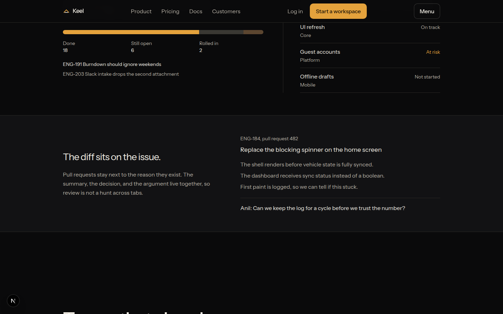

---

## 8. Customers

**Teams that already had a tracker.** A row of fictional names: Halcyon, Northwind Supply, Parcel & Rye, Lowroom, Marlowe, Fieldwork, Sable Health, Kite Co.

Quote: *We deleted the roadmap spreadsheet in the second week. The project list was already the truth, and it updates when the issues do.* — Nia Okonkwo, Head of Product, Halcyon.

Three short outcomes sit under the quote: shorter standup, retired roadmap deck, new hires stop asking where the work lives.

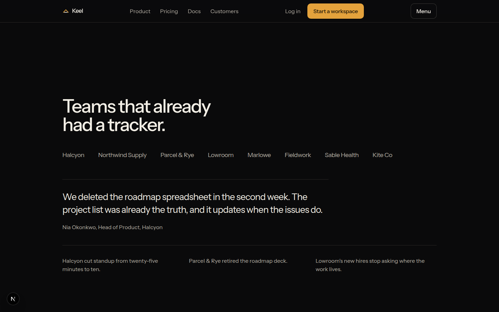

---

## 9. Pricing on the home page (monthly)

**Pay for people, not for a rollout.** Same product on every plan. The difference is how many teams, and how much review your security group needs.

Toggle **Yearly / Monthly**. Yearly prices include two months. The screenshot is monthly. **Yard** is the recommended card (amber border and amber CTA).

| Plan | Monthly | Who it is for |
| --- | --- | --- |
| Free | $0 / person | Pair still finding the shape of the product. Up to 3 people, 250 active issues, one team, cycles and projects. |
| Field | $12 / person | Product team that already ships every week. Unlimited people and issues, a team per product, Slack and email intake. |
| Yard | $20 / person | Most teams who have shipped for a year. Triage rules you can see firing, guest accounts, cycle time, weekday priority support. |
| Company | Custom | Security review and more than one org. SAML and SCIM, audit log, shared channel, named onboarding. |

Yearly would show Field at $10 and Yard at $16 per person. Plan CTAs: Start free, Choose Field, Choose Yard, Talk with us.

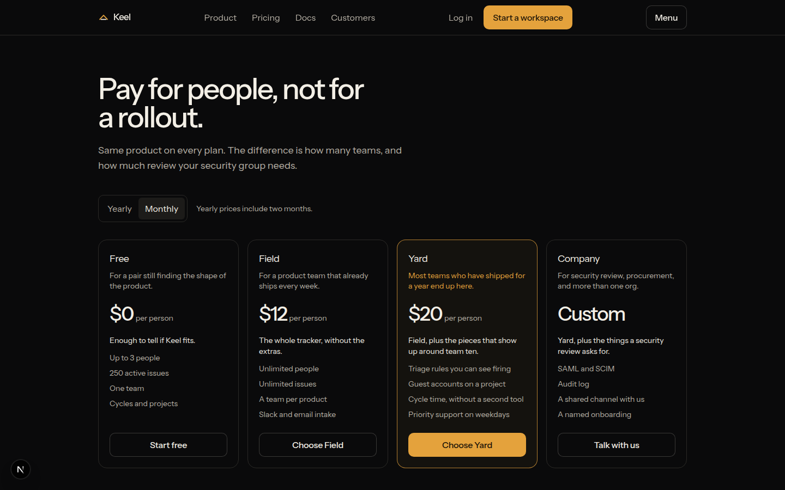

---

## 10. Pricing page

`/pricing` repeats the same four cards, then **Questions we actually get**:

- Can we start on Free and move to Yard later? Issues, cycles, and projects come with you. You pay the difference for the month you switch, and guests stay on projects you already shared.
- What happens to unfinished cycle work?
- Do you charge for guests?

The closing strip under the FAQ is the same as on home: **Start with the real backlog.** Free for three people. No sample project, and no card.

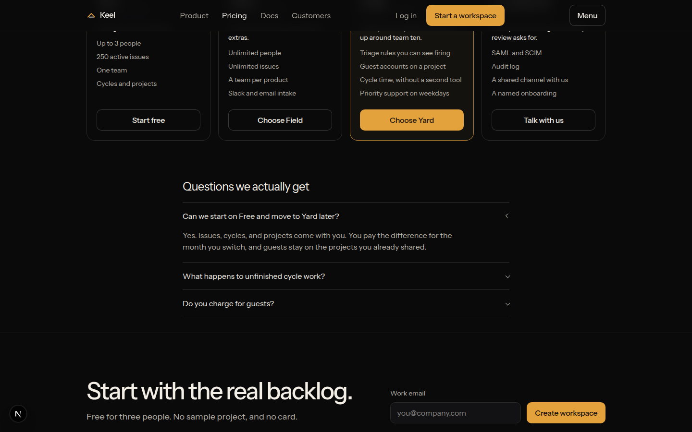

---

## 11. Closing CTA, plan row, and footer

Above the footer, plan actions sit in a row: Start free, Choose Field, **Choose Yard**, Talk with us.

Then the closing form: work email and **Create workspace**. Footer columns:

- **Product** — Intake, Cycles, Projects, Reviews, Pricing
- **Docs** — Overview, Getting started, Keyboard, Cycles, Triage rules
- **Company** — Customers, Log in, Start a workspace, Privacy, Terms

Copyright line: this preview keeps nothing on a server.

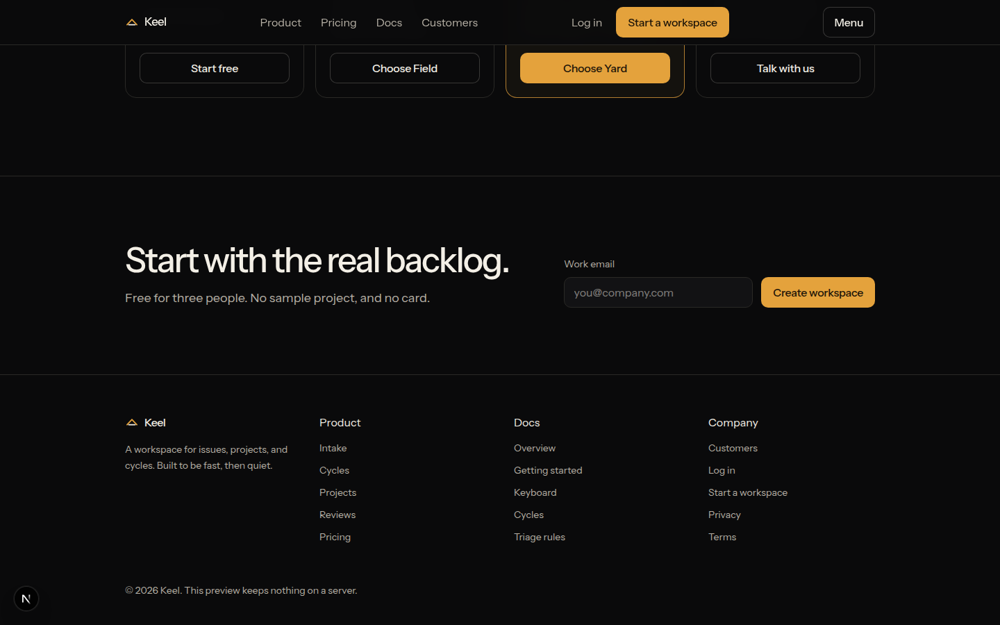

---

## 12. Docs: Keyboard

`/docs/keyboard` is one of four short articles. Breadcrumb **All docs**. Title **Keyboard**. Subtitle: the shortcuts that cover a normal day, and the ones left out on purpose.

Keel is keyboard-first. The mouse still works. You should not need it to create an issue, move it, or get back to the cycle you were just in.

| Keys | Does |
| --- | --- |
| `C` | Create an issue |
| `X` | Select the issue under the cursor |
| `G` then `I` | Go to triage |
| `G` then `C` | Go to the current cycle |
| `/` | Filter the list you are looking at |
| `Cmd Enter` | Save the issue you are editing |

Rare commands stay in the menu. The other articles: Getting started, Cycles, Triage rules.

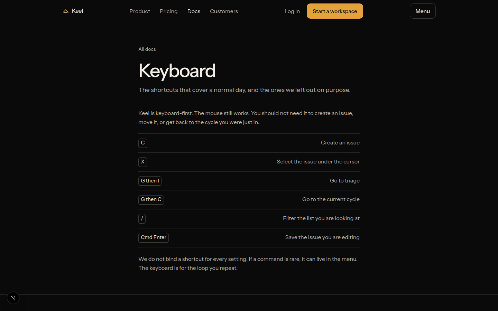

---

## 13. Start a workspace

The closing email form checks the address, then opens `/signup` with that email filled in. Signup asks for a workspace name, password, and plan, then `POST /api/auth/signup` stores the account and signs you in. Login uses `POST /api/auth/login`. Both land on `/account`.

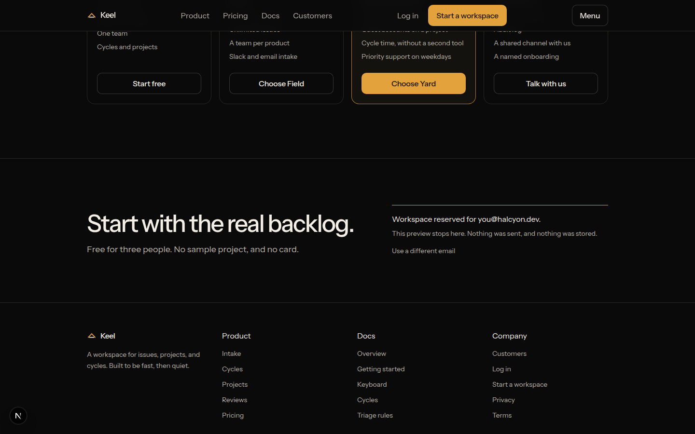

---

## Screenshot index

Every file in `images/`:

| File | Section above |
| --- | --- |
| `images/home-desktop.png` | 1. Home on desktop |
| `images/home-mobile.png` | 2. Home on a phone |
| `images/product-menu.png` | 3. Product menu |
| `images/mobile-menu.png` | 4. Phone menu |
| `images/intake.png` | 5. Intake |
| `images/cycles.png` | 6. Cycles and projects |
| `images/reviews.png` | 7. Reviews |
| `images/customers.png` | 8. Customers |
| `images/pricing-monthly.png` | 9. Pricing (monthly) |
| `images/pricing-page.png` | 10. Pricing page |
| `images/footer.png` | 11. Closing CTA and footer |
| `images/docs-keyboard.png` | 12. Docs: Keyboard |
| `images/workspace-confirmed.png` | 13. Start a workspace |

## Stack

Next.js 15 (App Router), React 19, Tailwind CSS 4, Framer Motion, TypeScript.
